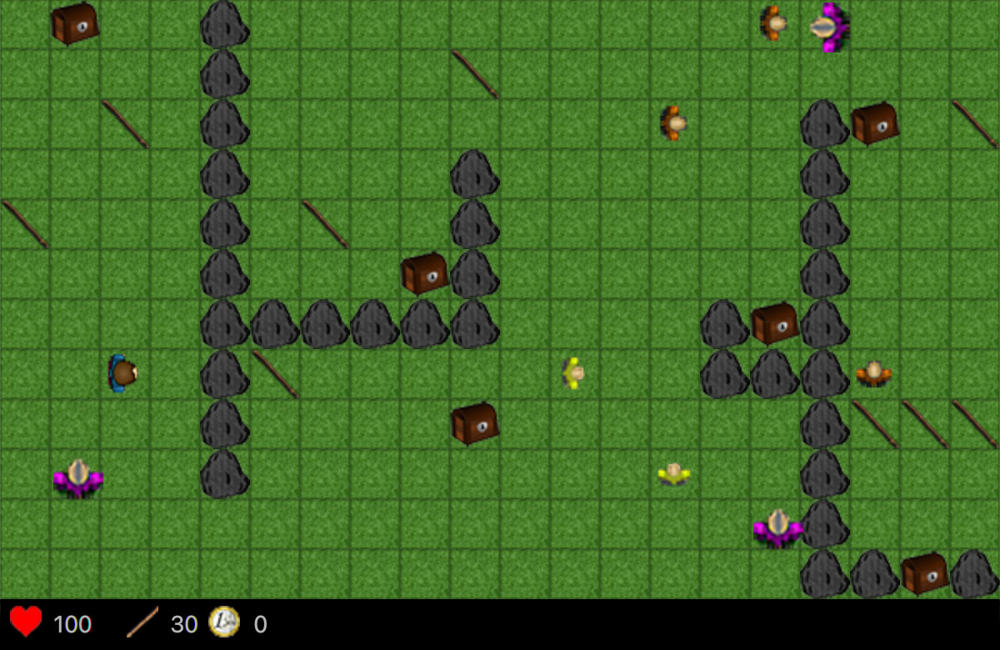

# little-big-engine

**little-big-engine** is a 2D game engine built with Java and JavaFX. (Though, in its current state, it's more of a 2D game with a level editor.) Players can collect sticks, battle enemies, and unlock chests to progress. Custom levels can be easily created by modifying a text file.

### A Note on Its History
This project was originally built in 2019, still during my first year of university. It's therefore rough around the edges. For a better representation of my actual skills, I recommend checking out my more recent projects, such as [scala-image-transformer](https://github.com/mariomarton/scala-image-transformer).

### Running little-big-engine
I recommend loading the project as a Maven project in an IDE such as InteliJ, while specifying OpenJDK 1.8 as the project SDK. Run the Maven `package` phase and finally run the `.jar` file to open **little-big-engine**.

---

## The Game

### Controls:
- **Arrow Keys or WASD** to move.
- **Spacebar** = **ATTACK!**
  - Also used to collect sticks and open chests.

### Gameplay:
- **You need a stick for each hit!**
  - Each attack consumes one stick.
- **Objective:**
  - Open all chests and eliminate all enemies.

---

## The Engine / Level Maker

### How to Create a Custom Level

#### Step 1:
- Navigate to the [levels](src/main/java/com/mario/LittleBigEngine/levels) directory and open the [custom_level.txt](src/main/java/com/mario/LittleBigEngine/levels/custom_level.txt) file.

#### Step 2:
- Modify the **BASICS** section:
  - Only change the numbers.
  - Maximum size is **50x50** cells.
  - The **starting position** goes from `0,0` to `size-1, size-1`.

#### Step 3:
- Define the **positions of STONES and STICKS**:
  - Format: `[position X/position Y, X/Y, X/Y ...]`

- Adjust the **number of sticks** the player starts with.

#### Step 4:
- Set up **chests and enemies**:
  - **Chests Format:**
    - `[amount-of-money/posX-posY, money/posX-posY ...]`
  - **Enemies Format:**
    - `[enemy-power/posX-posY, power/posX-posY ...]`

#### Step 5:
- Save the text file and enjoy your game!

### About _Enemy Power_
- **Enemy power values range from `1` to `5`.**
- This number represents the hits required to defeat the enemy.
- **Enemy Skins:**
  - **Powers 1, 2** → Yellow Skin
  - **Powers 3, 4** → Orange Skin
  - **Power 5** → Red Skin (**Superpower!**)

---

Enjoy building and playing in **little-big-engine**, contributions to the project are always welcome, too!

